# CA Connect

**Production-oriented Chartered Accountant client management platform**

CA Connect is a secure client management and communication platform designed for Chartered Accountant (CA) firms. It streamlines client communication, document collection, GST invoicing, appointment scheduling, and compliance tracking through dedicated role-based workspaces for CA administrators and clients.

## Features

### Multi-Role Workspace

* Separate workspaces for CA Administrators and Clients
* Role-based access control and permission-scoped functionality
* Dedicated workflows for client management and client interactions

### GST Billing and Invoicing

* Automatic GST calculations for:

  * CGST
  * SGST
  * IGST
* Server-side invoice PDF generation using PDFKit
* Invoice status management
* Support for marking invoices as paid

### Document Exchange Pipeline

Structured document request workflow:

```text
Requested → Uploaded → Reviewed → Approved / Rejected
```

* Create document requests for clients
* Secure file uploads
* Track document status throughout the review process
* Approve or reject submitted documents
* AWS S3-based file storage

### Real-Time Chat

* Real-time client-CA messaging using Socket.IO
* Typing indicators
* Read receipts
* Persistent conversation management

### Compliance Calendar

* Preloaded Indian tax filing deadlines
* Support for deadlines such as:

  * GSTR-1
  * GSTR-3B
  * ITR
* Compliance reminders and deadline tracking

### Notifications

* In-app notifications
* Background push notifications
* Alerts for relevant client and compliance activities

## Tech Stack

| Layer                   | Technologies                                       |
| ----------------------- | -------------------------------------------------- |
| Frontend                | React Native, Expo SDK 57, TypeScript, Expo Router |
| State and Data          | TanStack Query, Zustand                            |
| Real-Time Communication | Socket.IO Client                                   |
| Backend                 | Node.js, Express.js, TypeScript                    |
| API Communication       | REST APIs                                          |
| Database                | PostgreSQL                                         |
| ORM                     | Prisma                                             |
| File Storage            | AWS S3                                             |
| PDF Generation          | PDFKit                                             |
| Authentication          | JWT                                                |
| Testing                 | Jest                                               |
| Deployment              | Docker Compose                                     |

## Architecture

```text
                         CA Connect
                             |
              +--------------+--------------+
              |                             |
         Mobile Client                Backend API
       React Native / Expo        Node.js / Express
              |                             |
              |                    +--------+--------+
              |                    |        |        |
              |                 Prisma   Socket.IO  Services
              |                    |        |        |
              |                    |        |    PDF / Email
              |                    |        |
              +--------------------+--------+
                                   |
                              PostgreSQL
                                   |
                              AWS S3 Storage
```

## Repository Structure

```text
CA-Connect/
│
├── backend/
│   ├── prisma/
│   │   ├── schema.prisma
│   │   └── seed.ts
│   │
│   ├── src/
│   │   ├── controllers/
│   │   ├── middleware/
│   │   ├── routes/
│   │   ├── services/
│   │   ├── utils/
│   │   └── server.ts
│   │
│   ├── tests/
│   ├── Dockerfile
│   ├── docker-compose.yml
│   ├── package.json
│   └── tsconfig.json
│
├── mobile/
│   ├── app/
│   │   ├── auth/
│   │   ├── admin/
│   │   └── client/
│   │
│   ├── components/
│   ├── constants/
│   ├── hooks/
│   ├── services/
│   ├── package.json
│   └── tsconfig.json
│
└── README.md
```

## API Reference

### Authentication

| Method | Endpoint                    | Description                                         |
| ------ | --------------------------- | --------------------------------------------------- |
| `POST` | `/api/auth/login`           | Authenticate a user and issue access/refresh tokens |
| `POST` | `/api/auth/refresh-token`   | Refresh an expired access token                     |
| `POST` | `/api/auth/forgot-password` | Request a password reset link                       |
| `POST` | `/api/auth/reset-password`  | Reset a password using a valid reset token          |

### Clients

| Method   | Endpoint           | Description             |
| -------- | ------------------ | ----------------------- |
| `GET`    | `/api/clients`     | Retrieve all clients    |
| `POST`   | `/api/clients`     | Create a client profile |
| `DELETE` | `/api/clients/:id` | Delete a client profile |

### Invoices

| Method | Endpoint                      | Description                          |
| ------ | ----------------------------- | ------------------------------------ |
| `POST` | `/api/invoices`               | Generate a GST invoice               |
| `GET`  | `/api/invoices/:id/pdf`       | Generate and retrieve an invoice PDF |
| `PUT`  | `/api/invoices/:id/mark-paid` | Mark an invoice as paid              |

### Documents

| Method | Endpoint                     | Description                         |
| ------ | ---------------------------- | ----------------------------------- |
| `POST` | `/api/documents/:id/upload`  | Upload a file to a document request |
| `PUT`  | `/api/documents/:id/approve` | Approve an uploaded document        |

## Authentication

CA Connect uses JWT-based authentication.

The authentication flow supports:

```text
Login
  |
  v
Access Token + Refresh Token
  |
  v
Authenticated API Requests
  |
  v
Access Token Expiration
  |
  v
Refresh Token
  |
  v
New Access Token
```

Protected routes use JWT verification middleware to ensure that users can access only resources permitted by their role.

## Database

The backend uses PostgreSQL with Prisma ORM.

Prisma is responsible for:

* Database schema management
* Type-safe database queries
* Migrations and schema synchronization
* Seed data
* Relationships between users, clients, invoices, documents, messages, and compliance records

For local development, the database schema can be synchronized using:

```bash
npx prisma db push
```

Seed the database with:

```bash
npm run prisma:seed
```

## Setup and Installation

### Prerequisites

Make sure the following are installed:

* Node.js 20+
* PostgreSQL
* npm
* Expo CLI
* Git
* Docker (optional)

### 1. Clone the Repository

```bash
git clone ca-connect
cd CA-Connect
```

### 2. Backend Setup

```bash
cd backend
npm install
```

Configure the required environment variables in `.env`.

Example:

```env
DATABASE_URL=
JWT_SECRET=
JWT_REFRESH_SECRET=
AWS_ACCESS_KEY_ID=
AWS_SECRET_ACCESS_KEY=
AWS_REGION=
AWS_S3_BUCKET=
```

Initialize the database:

```bash
npx prisma db push
npm run prisma:seed
```

Start the development server:

```bash
npm run dev
```

The backend will run on:

```text
http://localhost:3000
```

Health check:

```text
http://localhost:3000/health
```

### 3. Mobile Setup

Open a separate terminal:

```bash
cd mobile
npm install
npx expo start -c
```

Use the Expo development server to run the application on a physical device, emulator, or simulator.

## Running Tests

Backend integration tests are written using Jest.

```bash
cd backend
npm run test
```

To run tests in watch mode, if configured:

```bash
npm run test:watch
```

## Docker Deployment

Docker Compose can be used to run the backend and PostgreSQL services together.

From the backend directory:

```bash
cd backend
docker-compose up --build -d
```

Check the API health endpoint:

```text
http://localhost:3000/health
```

To stop the containers:

```bash
docker-compose down
```

## Security

CA Connect is designed with security-oriented backend practices including:

* JWT-based authentication
* Role-based authorization
* Protected API routes
* Request rate limiting
* Secure file upload handling
* AWS S3-based file storage
* Environment-based secret configuration
* Server-side invoice generation
* Permission-scoped client access

Production deployments should additionally use HTTPS, secure secret management, properly configured CORS, production database credentials, and restricted AWS IAM permissions.

## Planned Improvements

### Automated Document and OCR Processing

Add OCR-based extraction for uploaded tax forms, invoices, and receipts to automatically identify relevant information and populate compliance checklists.

### Online Invoice Payments

Integrate an Indian payment gateway such as Razorpay to allow clients to settle invoices directly through the application.

### Additional Planned Features

* Advanced compliance tracking
* Automated email notifications
* Expanded reporting and analytics
* Improved document search
* Audit logging
* More granular role and permission management

## Current Status

**Status: Local Development**

The application is currently runnable locally using the provided setup instructions and can be started using Docker Compose for the backend and PostgreSQL environment.

Production deployment has not yet been completed.

## Screenshots
## Screenshots

## Screenshots

### Landing and Portal Access

| Landing Page | Portal Access |
|---|---|
| 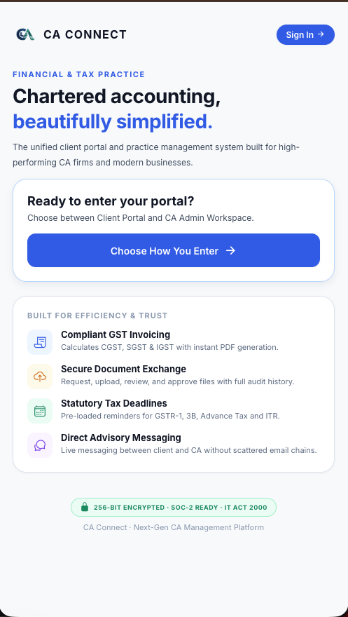 | 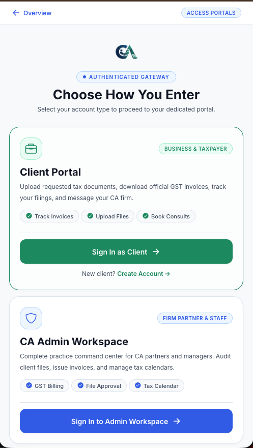 |

### Landing Pages

| CA Administrator | Client |
|---|---|
| 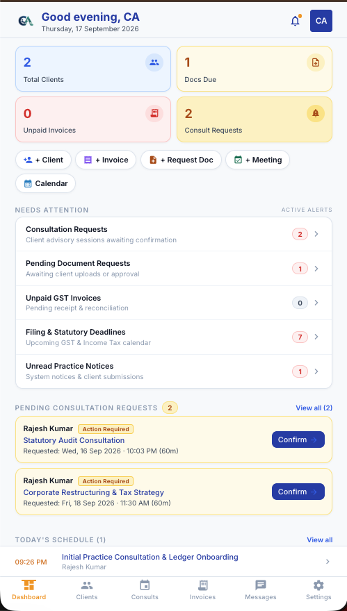 | 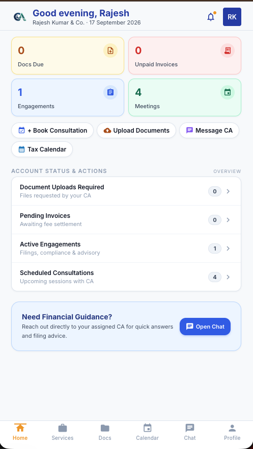 |

### Active Services and Compliance

| Active Services | Compliance Calendar |
|---|---|
| 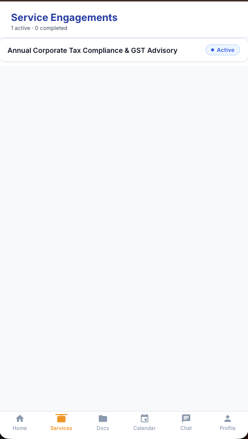 | 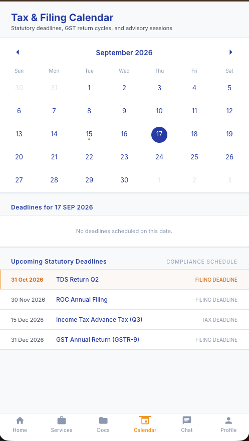 |

### Communication and Profile

| Messages | Profile |
|---|---|
| 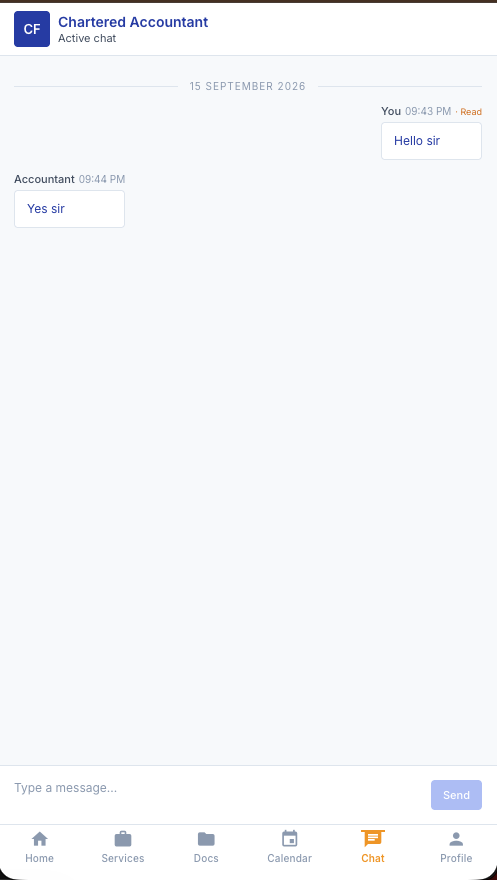 | 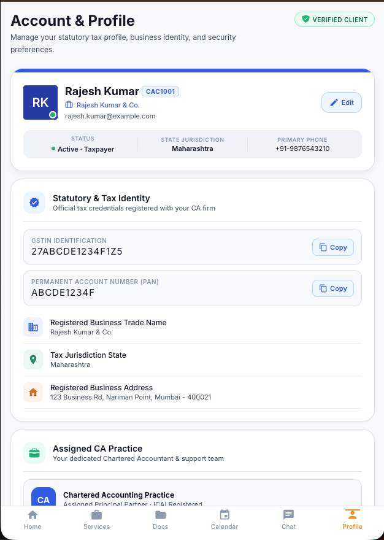 |

### Additional Screens

| Client Directory | Invoice Review |
|---|---|
| 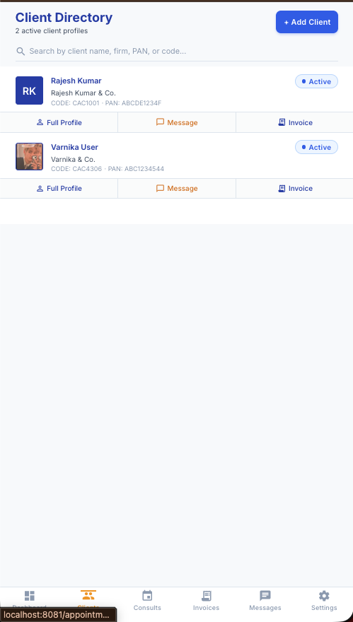 | 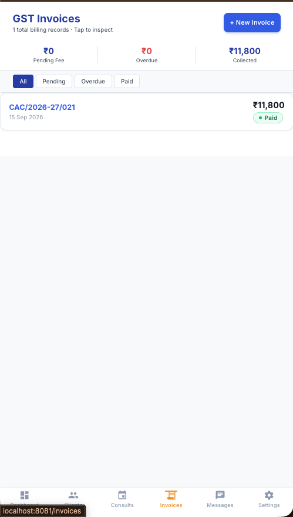 |

| Confirmation |
|---|
| 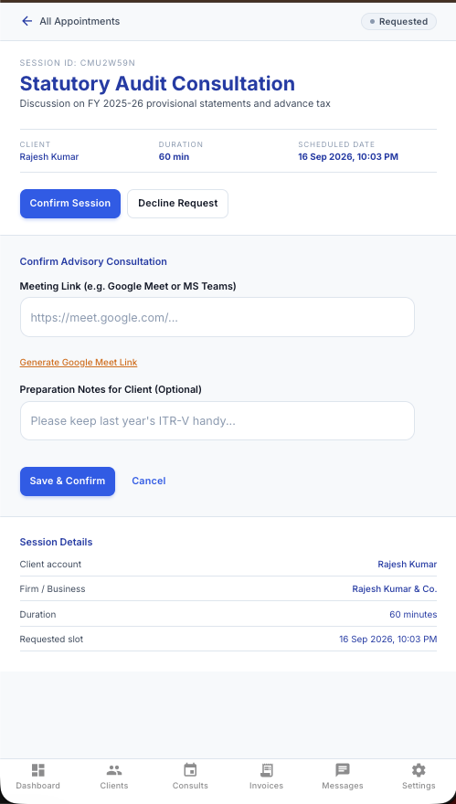 |


